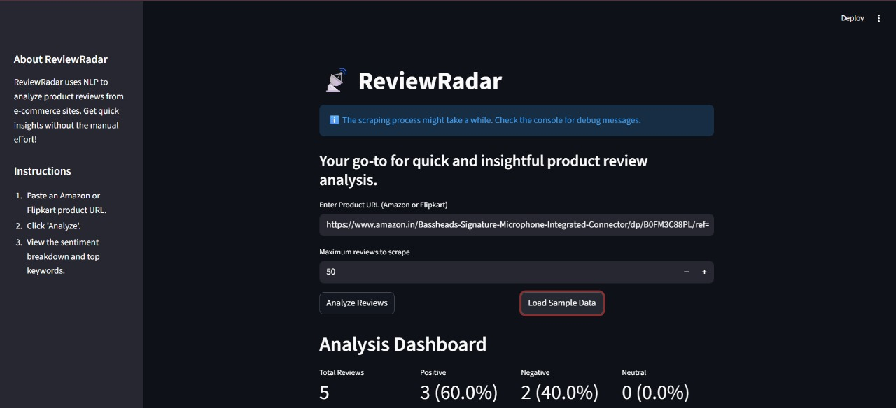
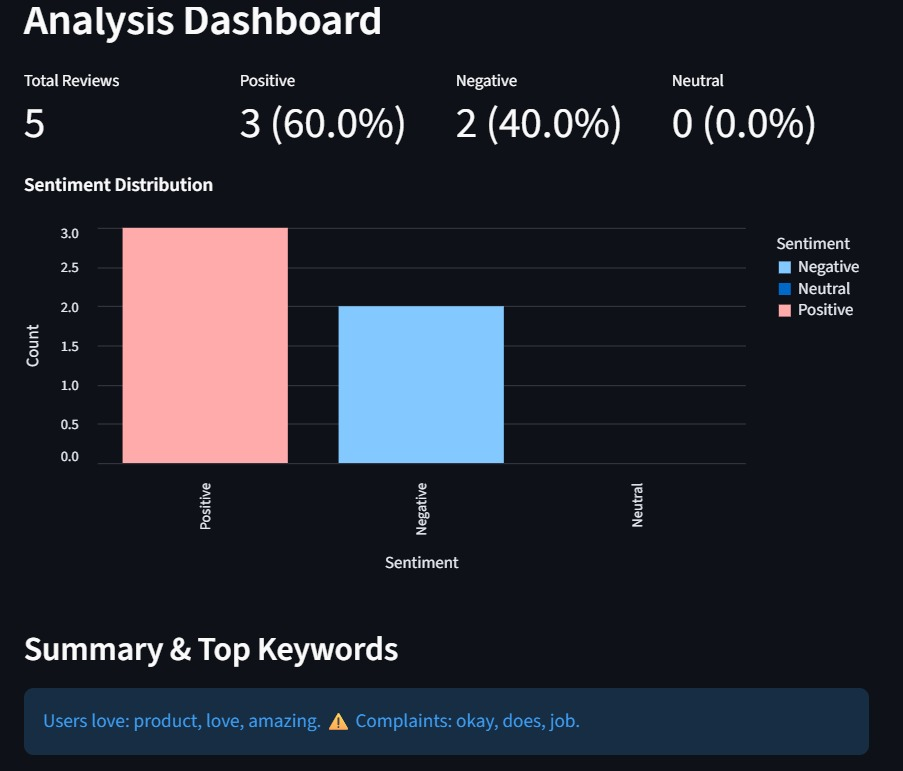

# ReviewRadar 📡

## 🔹 Project Overview

**Problem:** It's hard to get a quick, unbiased summary of product reviews.

**Solution:** ReviewRadar scrapes reviews from e-commerce sites, analyzes sentiment, and presents a concise dashboard with actionable insights.

## 🔹 Features

*   **URL Scraping:** Extracts reviews from Amazon & Flipkart product pages.
*   **Sentiment Analysis:** Classifies reviews as positive, negative, or neutral.
*   **Insightful Dashboard:** Visualizes sentiment distribution and top keywords.

## 🔹 Setup & Installation

1.  Clone the repository:
    ```bash
    git clone https://github.com/your-username/BitNBuild-25_GitSetGo.git
    ```
2.  Install dependencies:
    ```bash
    pip install -r requirements.txt
    ```

## 🔹 Running the Project

1.  Run the Streamlit app:
    ```bash
    streamlit run app.py
    ```
2.  Paste a product URL into the input field and click "Analyze".

## 🔹 Screenshots




## 🔹 Future Enhancements

*   **Browser Extension:** Analyze reviews directly on the product page.
*   **Multilingual Support:** Analyze reviews in multiple languages.
*   **Aspect-Based Sentiment:** Pinpoint sentiment on specific features (e.g., "battery life is great," "screen is dim").

## 🔹 Presentation on Project Summary

* Canva Link: [Review Radar](https://www.canva.com/design/DAG0Pc1HEyg/tmEJ5wCr0TPe8lY8r_6tVg/view?utm_content=DAG0Pc1HEyg&utm_campaign=designshare&utm_medium=link2&utm_source=uniquelinks&utlId=h5282bdacea)

## 🔹 Tools and Libraries used

1.  *requests*
2.  *beautifulsoup4* (imported as BeautifulSoup)
3.  *transformers*
4.  *torch*
5.  *scikit-learn* (imported components like TfidfVectorizer are from sklearn)
6.  *streamlit* (imported as st)
7.  *altair* (imported as alt)
8.  *pandas* (imported as pd)
9.  *numpy* (imported as np)
10. *json*
11. *time*
12. *random*
13. *re*
14. *logging*

## 🔹 Team Members:

1. Sanskar Indulkar (Team Leader)
2. Parth Nagare
3. Aaradhya Raut
